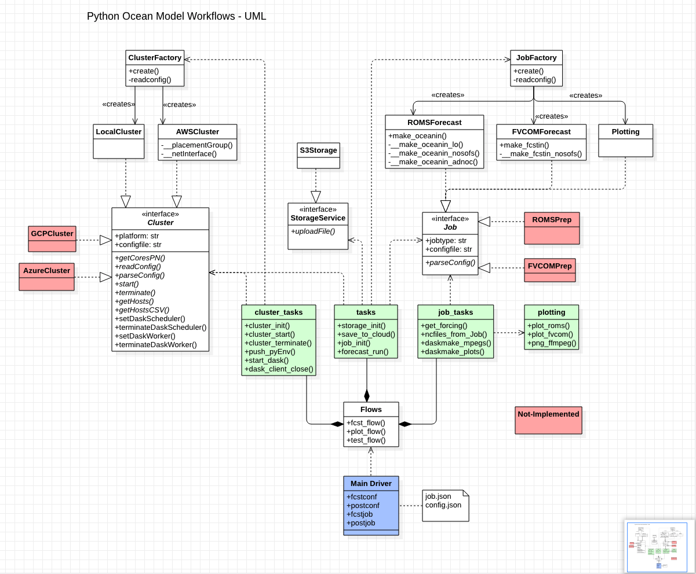

## CloudFlow 
CloudFlow is a customizable workflow system using Prefect.
Prefect is an orchestrator for data-intensive workflows. 

Example modeling workflows have been created using mostly python and some UNIX shell scripts.

Here is a typical workflow example, showing the different steps:

#### CloudFlow API specification for developers
https://ioos.github.io/Cloud-Sandbox

#### CloudFlow UML diagram for developers

