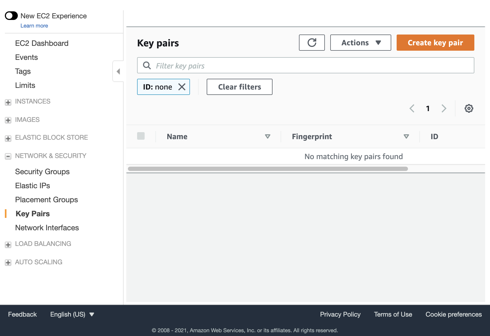

## Deploying a New Sandbox

### Prerequisites

Install the AWS CLI:  
https://docs.aws.amazon.com/cli/latest/userguide/install-cliv2.html

Make sure the CLI is configured to use your AWS account:  
https://docs.aws.amazon.com/cli/latest/userguide/cli-configure-quickstart.html#cli-configure-quickstart-config

**AWS credentials with the neccessary permissions:**  
If you are the owner of the AWS account and/or have full admin permissions this shouldn't be a problem. Otherwise, talk to your AWS admin about obtaining the needed permissions.

Install the Terraform CLI:  
***Use Terraform version 1.5.7***   
Newer versions are NOT open source for commercial use.

Download and install the package that matches your desktop computer's architecture.  
https://releases.hashicorp.com/terraform/1.5.7/  

Terraform Language Documentation
https://developer.hashicorp.com/terraform/language/v1.5.x

On a Mac you can also install it using brew:
```brew install terraform```

#### Clone this repository:
(e.g. using the default path ./Cloud-Sandbox)  
```
git clone https://github.com/ioos/Cloud-Sandbox.git
```

### Initialize Terraform
Terraform will create **all** of the AWS resources needed for the sandbox. 

This includes the VPC, subnet, security groups, EFS networked disk volumes, and others. AWS has a default limit of 5 VPCs per region. You will have to request a quota increase from AWS if you are already at your limit.

Optionally: terraform can use existing VPC, subnet, and security groups by specifying them in the confuration file.

#### Initialize S3 Resources for the Terraform Backend 
Terraform tracks internal resource state separately from the project state.  Cloud-Sandbox is configured to use a Terraform S3 backend for tracking resource state.  These resources are created within the `remote-state` module.  

 **This step only needs to be performed once per AWS account!**
 
***------------------------------------------------------------***

Initialize the resources in the remote-state module (S3 bucket) by running the following commands in the Cloud-Sandbox/terraform/remote-state directory.  Running the `terraform apply` command verbatim as follows will use the default bucket configuration as provided by `s3.defaults.tfvars`.  Supply a different `.tfvars` file to override the defaults.  

**First time only**
```
cd ./Cloud-Sandbox/terraform/remote-state
[Edit the s3.defaults.tfvars file and specify a unique bucket name.]
terraform init
terraform apply -var-file=s3.defaults.tfvars
```

The S3 bucket created in this step will then be used by the main Cloud-Sandbox project as the Terraform backend to store the resource state. If your local folder or state is deleted, the state can be retrieved from S3.

***------------------------------------------------------------***

#### Initialize the Cloud-Sandbox project
Once the resources from the remote-state module are deployed you can initialize the main Cloud-Sandbox project.

Make sure the bucket name in config.s3.tfbackend file is the same as specified in the previous step.

Then run the following command: 
```
cd ./Cloud-Sandbox/terraform
terraform init -backend-config=config.s3.tfbackend
```
The `-backend-config` parameter is used to provide the Availability Zone and S3 bucket name to use.  A different `.tfbackend` config file can be provided if the defaults have been modified within the remote-state module.
 
If for some reason it is necessary to change from one S3 backend to another, the `--reconfigure` param can be used:

```
terraform init --reconfigure --backend-config=alternate.s3.tfbackend
```
#### Terraform Workspaces
If multiple users are deploying different Cloud Sandbox resources in the same AWS account, each user should create their own Terraform workspace:

```
cd ./Cloud-Sandbox/terraform
terraform workspace new my_workspace
```

Alternatively, list and select an existing workspace:

```
terraform workspace list
terraform workspace select existing_workspace
```

For more info on workspaces, this is a good overview: https://spacelift.io/blog/terraform-workspaces

### Generate a Key Pair ###
Terraform requires an existing key-pair to provide SSH access to the instance(s). The public key will be added to the created instance when it is created. Then the private key can be used to login it.

There are multiple ways to provide an acceptable key. You can use an existing key-pair that you have access to, or you can create a new one. There are two ways to create a new AWS EC2 key-pair, one using the AWS EC2 Console and the other using the AWS CLI.

**Using the AWS EC2 Console:**

Select "Key Pairs" under "Network & Security", then select "Create key pair" _(see screenshot below)_. **Save this private key someplace safe!** 



**Using the AWS CLI:**

<pre>
aws ec2 create-key-pair --key-name <b><i>your-key-pair</i></b> --query "KeyMaterial" --output text > <b><i>your-key-pair.pem</i></b> 
</pre>
Optionally specify the AWS region:  
<pre>
aws --region="us-east-2" ec2 create-key-pair --key-name <b><i>your-key-pair</i></b> --query "KeyMaterial" --output text > <b><i>your-key-pair.pem</i></b>  
</pre>
The private key file must have permissions that allows access only to you, e.g. if on Linux 

<pre>
chmod 600 <b><i>your-key-pair.pem</i></b> 
</pre>

**To obtain the public key from the private key:**
_You will need to cut and paste the key into the public_key variable mentioned below._

<pre>
ssh-keygen -y -f <b><i>your-key-pair.pem</i></b> 
</pre>

### Configure Terraform

Edit the following file to specify custom values to use for the following: 

`./Cloud-Sandbox/terraform/mysettings.tfvars`

| Variable | Value | Description |
| -------- | ----- | ----------- |
| allowed_ssh_cidr | "your publicly visible IPv4 address/32" | You can find your IP at https://www.whatismyip.com/ |
| key_name | "your-key-pair" | The key pair generated in the prior step |
| public_key | "ssh-rsa your_public_key" | The public key obtained in the prior step. Must include "ssh-rsa", assuming it is an rsa key |
| vpc_id | "vpc- your_vpc_id" | The ID of an existing VPC for Terraform to use for deployment |
| subnet_id | "subnet- your_subnet_id" | The ID of an existing Subnet for Terraform to use for deployment |


Optionally change these settings to override the defaults:

| Variable              | Default value                                | Description                    |
|-----------------------|----------------------------------------------|--------------------------------|
| preferred_region  | "us-east-2"                    | The AWS region to use |
| name_tag     | "IOOS Cloud Sandbox Terraform" | The "Name" tag for the instance |
| nameprefix   | "ioos_cloud_sandbox" | This is attached to the name of resources created. |
| project_tag      | "IOOS-Cloud-Sandbox"           | The "Project" tag for the resources created |
| availability_zone | "us-east-2a"                   | The AWS Availability zone  |
| instance_type     | "t3.medium"                    | EC2 Instance type to use for setup |
| use_efa           | false                           | Whether or not to use [AWS Elastic Fabric Adapter](https://aws.amazon.com/hpc/efa/) |

Run `terrform plan` to check for errors and see what resources will be created: 
```
terraform plan -var-file="mysettings.tfvars"
```

Run `terraform apply` to create the AWS resources.
```
terraform apply -var-file="mysettings.tfvars"
```

Alternative method:
```
terraform plan -var-file=mysettings.tfvars -out=my.plan
terraform apply my.plan
```

Enter 'yes' to create the resources.  

---
**NOTES:**

You may run into something similar to the following error if applying Terraform on an AWS account where more than one Cloud Sandbox have been deployed:  
```
Error: error creating IAM Role (ioos_cloud_sandbox_terraform_role): EntityAlreadyExists: Role with name ioos_cloud_sandbox_terraform_role already exists.
```
If this happens, change the "nameprefix" variable to something unique and re-run the two commands above.

---

### Install all of the required software and libraries
This is done automatically in `init_template.tpl`  
Some of the things it installs:  
- GNU Fortran, C++, and C compilers
- IntelOne API Fortran, C++, and C compilers
- IntelOne API MPI libraries
- NetCDF, HDF5, and other libraries needed by the models.

It takes around 45 minutes for the entire setup to complete,
and about another 10 minutes for the machine image/snapshot creation.  
Wait a few minutes before logging in, it takes a minute or two for the instance to boot up.

Details about the created instance and how to login will be output when completed.

Terraform output can also be viewed any time by running the following command from the ./terraform directory:
```
terraform output
```

**Example output**
```
instance_id = "i-01346de00e778f"
instance_public_dns = "ec2-3-219-217-151.compute-1.amazonaws.com"
instance_public_ip = "3.219.217.151"
login_command = "ssh -i <path-to-key>/my-sandbox.pem centos@ec2-3-219-217-151.compute-1.amazonaws.
```

The installation script will continue to run on the instance after terraform completes.

You can log into the newly created EC2 instance and watch the installation progress. 
```
Example:
ssh -i my-sandbox.pem ec2-user@ec2-3-219-217-151.compute-1.amazonaws
sudo -i
tail -f /root/setup.log
```


### Amazon Machine Image (AMI) for the compute nodes
This is done automatically.
The AMI ID will be found at the end of the setup.log file.
It can also be found in the AWS console or via the AWS CLI. This AMI ID will be needed to run the models.

### Optional: After setting everything up, you can change the instance type to something smaller
Edit mysettings.tfvars and change the following:

Example: `instance_type = "t3.micro"`

Run terraform apply:
```
terraform apply -var-file="mysettings.tfvars"
```
*If terraform says the instance needs to be destroyed first, type "no" when prompted to keep the existing instance. There are other ways to change the instance type.*

### Cleanup - delete the sandbox
When done using the Cloud Sandbox deployment, all of the AWS resources (including disks!) can be destroyed with the following command:
```
terraform destroy -var-file="mysettings.tfvars"
```

***Make sure any needed data is saved to S3 or other configured cloud backups.***

### Recovering Terraform State

In case you've already deployed cloud resources but your local Cloud Sandbox terraform directory/files are destroyed or or lost, or if you work on multiple copies, you can restore the Terraform state from the remote S3 bucket by simply running `terraform init -backend-config=config.s3.tfbackend` again. If you were using a custom workspace, switch to that workspace with `terraform workspace select`. Once you run `terraform plan` you should see that no new resources need to be created.

*© Copyright 2025 RPS Group. All rights reserved.*
