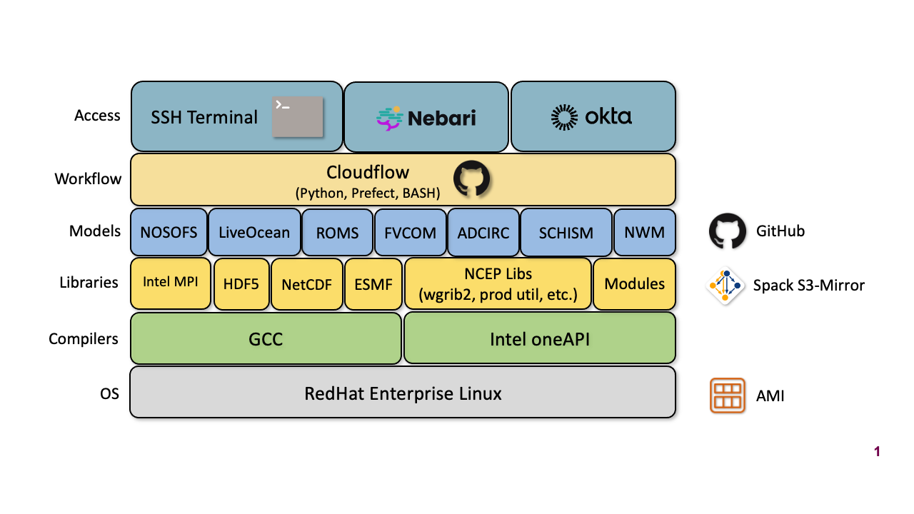

# IOOS Cloud Sandbox

The IOOS Cloud Sandbox is a collaborative platform for running regional coastal models in the cloud.

It provides repeatable configurations, model code and required libraries, input data, and analysis of model outputs. The Sandbox provisions Cloud HPC to aid in the development of services and models, and also supports running and validating models. The Sandbox is intended for use across industries and is inclusive to anyone who wants to develop, enhance, and run coastal models.

### Use cases
- Inter-organization collaboration
- University graduate courses
- Hindcasts/Reanalysis
- Research to Operations (R2O)
- On-demand HPC capacity
- Quasi-operational HPC fail-over (natural disasters, data-center problems)
- AI/ML training

### Deployment options

- **Self deployed/hosted**: Deploy using your own AWS cloud account
- **IOOS hosted**: NOAA AWS Government Cloud – Lynker contract
- **RPS hosted**: Isolated secure Virtual Private Cloud (VPC)

### The Cloud Sandbox has been used to run:

- Operational versions of the [NOSOFS ROMS and FVCOM Models](https://github.com/ioos/nosofs-NCO)
- [LiveOcean model](https://comt.ioos.us/projects/liveocean) from the University of Washington
- WRF/ROMS ESMF Coupled (Hurricane Irene test case)
- WRF/ROMS/SWAN
- ADCIRC (Hurricane Florence test case)
- [CORA ADCIRC](https://registry.opendata.aws/noaa-nos-cora/) model
- [SCHISM](https://ccrm.vims.edu/schismweb/)
- [National Water Model](https://water.noaa.gov/about/nwm)
- [UCLA-ROMS](https://github.com/CESR-lab/ucla-roms)
- [UFS-Coastal](https://github.com/oceanmodeling/ufs-coastal-app)
- [ECCOFS](https://registry.opendata.aws/noaa-nos-eccofs/)
- [SECOFS](https://link.springer.com/article/10.1007/s10236-026-01794-8)
- [NECOFS](https://comt.ioos.us/projects/necofs_transition)

## Documentation

Comprehensive guides and instructions for provisioning, configuring, and executing workflows on the Cloud Sandbox:

* **[Infrastructure Deployment Guide](DEPLOYMENT.md)**: Instructions for deploying and hosting a Cloud Sandbox instance on AWS using Terraform.
* **[Cloudflow Workflow System Overview](CLOUDFLOW.md)**: An architectural overview of the Cloudflow orchestration framework and Prefect server setup.
* **[Prefect v3 Setup & Troubleshooting Guide](PREFECTV3.md)**: Configuration details for running the local Prefect v3 server in the background, persisting results, establishing SSH tunnels to the dashboard UI (`http://localhost:4200/dashboard`), and managing active flow runs via CLI.
* **[Local Python Miniforge3 Installation Guide](LOCAL_PYTHON_MINIFORGE3_INSTALLATION_CLOUD_SANDBOX_INSTRUCTIONS.md)**: Step-by-step instructions for installing a isolated Miniforge3 package manager and compiling a Cloudflow-compatible Python environment under your personal directory on the EFS volume of a given head node.

## I want to...

- Run a model in an existing cloud sandbox
    - [NOS OFS Models](models/nosofs/NOSOFS-MODELS.md)
    - [LiveOcean Model](models/liveocean/LIVEOCEAN-MODEL.md)
    - [CORA](models/adcirc-cora/README.md)
    - [UCLA-ROMS](models/ucla-roms/README.md)
    - [UFS-Coastal](models/ufscoastal/README.md)
    - [NECOFS](models/necofs/README.md)
    - [SECOFS](models/secofs/README.md)
    - [ECCOFS](models/eccofs/README.md)
    - [PYTHON](cloudflow/CLOUDFLOW_PYTHON_MODEL_EXECUTION_INSTRUCTIONS.md)
    - [Basic Model Implementation](cloudflow/CLOUDFLOW_MODEL_EXECUTION_INSTRUCTIONS.md)

- [Integrate a new model into the cloud sandbox](CLOUD_SANDBOX_MODEL_INTEGRATION_TEMPLATE.md)

- [Deploy a new cloud sandbox](DEPLOYMENT.md)

## Software Stack

The Cloud Sandbox uses [CloudFlow](CLOUDFLOW.md) to orchestrate the execution of the model. CloudFlow is a customized workflow for running models built on [Prefect Workflows](https://docs-v1.prefect.io/api/0.15.13/).

## Software Architecture 

The Cloud Sandbox uses [Terraform](https://www.terraform.io/) to deploy resources to the cloud. The sandbox currently only supports the Amazon Web Services (AWS) cloud platform.

- **Head Node**: The head node is the machine that runs the CloudFlow scheduler. Users can SSH into this machine to run CloudFlow tasks.
- **Preconfigured AMI**: This Amazon Machine Image (AMI) contains all of the necessary code to run the model. This image will run on the worker nodes.
- **Worker Nodes**: The worker nodes are provisioned by Terraform and run CloudFlow tasks. This runs the preconfigured AMI.
