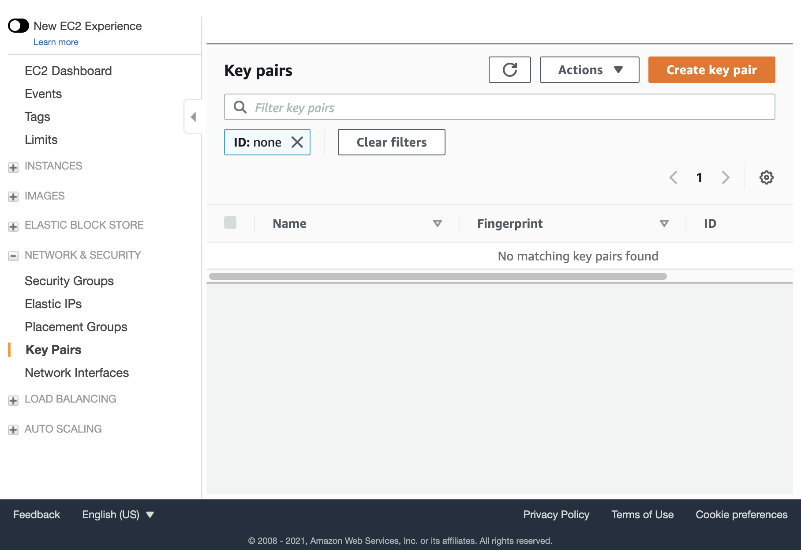

# IOOS Cloud-Sandbox

The IOOS Cloud Sandbox is a platform for running regional coastal models in the cloud. The cloud resources are configured using Terraform and installs all dependencies necessary to run the models.

## Deploying a New Sandbox

### Prerequisites

Install the AWS CLI: <br>
https://docs.aws.amazon.com/cli/latest/userguide/install-cliv2.html

Make sure the CLI is configured to use your AWS account: <br>
https://docs.aws.amazon.com/cli/latest/userguide/cli-configure-quickstart.html#cli-configure-quickstart-config

Install the Terraform CLI: <br>
https://www.terraform.io/downloads.html

### Initialize Terraform
Terraform will create **all** of the AWS resources needed for the sandbox. 
This includes the VPC, subnet, security groups, EFS networked disk volumes, and others. AWS has a default limit of 5 VPCs per region. You will have to request a quota increase from AWS if you are already at your limit.

Clone this repository: <br>
*(e.g. using the default path ./Cloud-Sandbox)*
```
git clone https://github.com/ioos/Cloud-Sandbox.git
```

Terraform tracks internal resource state separately from the project state. 

Initialize the remote state resources by running the following commands in the `Cloud-Sandbox/terraform/remote-state` directory. **This only needs to be performed once per AWS account.**

```
cd ./Cloud-Sandbox/terraform/remote-state
terraform init
terraform apply
```

Once those resources are deployed you can initialize the project state.

Run the following command to initialize Terraform for the project: 
```
cd ./Cloud-Sandbox/terraform
terraform init
```

If multiple users are deploying different Cloud Sandbox resources in the same AWS account, each user should create their own Terraform workspace:

```
terraform workspace new my_workspace
```

Alternatively, list and select an existing workspace:

```
terraform workspace list
terraform workspace select existing_workspace
```

For more info on workspaces, this is a good overview: https://spacelift.io/blog/terraform-workspaces

### Generate a Key Pair ###
Terraform requires an existing key-pair to provide SSH access to the instance(s). The public key will be added to the created instance when it is created. Then the private key can be used to login it.

There are multiple ways to provide an acceptable key. You can use an existing key-pair that you have access to, or you can create a new one. There are two ways to create a new AWS EC2 key-pair, one using the AWS EC2 Console and the other using the AWS CLI.

**Using the AWS EC2 Console:**

Select "Key Pairs" under "Network & Security", then select "Create key pair" _(see screenshot below)_. **Save this private key someplace safe!** 



**Using the AWS CLI:**

<pre>
aws ec2 create-key-pair --key-name <b><i>your-key-pair</i></b> --query "KeyMaterial" --output text > <b><i>your-key-pair.pem</i></b> 
</pre>
Optionally specify the AWS region:  
<pre>
aws --region="us-east-2" ec2 create-key-pair --key-name <b><i>your-key-pair</i></b> --query "KeyMaterial" --output text > <b><i>your-key-pair.pem</i></b>  
</pre>
The private key file must have permissions that allows access only to you, e.g. if on Linux 

<pre>
chmod 600 <b><i>your-key-pair.pem</i></b> 
</pre>

**To obtain the public key from the private key:**<br>
_You will need to cut and paste the key into the public_key variable mentioned below._

<pre>
ssh-keygen -y -f <b><i>your-key-pair.pem</i></b> 
</pre>

### Configure Terraform

Edit the following file to specify custom values to use for the following: 

`./Cloud-Sandbox/terraform/mysettings.tfvars`

| Variable | Value | Description |
| -------- | ----- | ----------- |
| allowed_ssh_cidr | "your publicly visible IPv4 address/32" | You can find your IP at https://www.whatismyip.com/ |
| key_name | "your-key-pair" | The key pair generated in the prior step |
| public_key | "ssh-rsa your_public_key" | The public key obtained in the prior step. Must include "ssh-rsa", assuming it is an rsa key |

Optionally change these settings to override the defaults:

| Variable              | Default value                                | Description                    |
|-----------------------|----------------------------------------------|--------------------------------|
| preferred_region  | "us-east-1"                    | The AWS region to use |
| name_tag     | "IOOS Cloud Sandbox Terraform" | The "Name" tag for the instance |
| project_tag      | "IOOS-cloud-sandbox"           | The "Project" tag for the resources created |
| availability_zone | "us-east-1a"                   | The AWS Availability zone  |
| instance_type     | "t3.medium"                    | EC2 Instance type to use for setup |
| use_efa           | true                           | Whether or not to use [AWS Elastic Fabric Adapter](https://aws.amazon.com/hpc/efa/) |

Run `terrform plan` to check for errors and see what resources will be created: 
```
terraform plan -var-file="mysettings.tfvars"
```

Run `terraform apply` to create the AWS resources.
```
terraform apply -var-file="mysettings.tfvars"
```

Enter 'yes' to create the resources.  

---
**NOTE**

You may run into the following error if applying Terraform on an AWS account where several Cloud Sandbox instances have been created:  
```
Error: error creating IAM Role (ioos_cloud_sandbox_terraform_role): EntityAlreadyExists: Role with name ioos_cloud_sandbox_terraform_role already exists.
```

To resolve a resource conflict, use `terraform import` to point terraform to the existing resource instead of creating a new one. For example, in this case `ioos_cloud_sandbox_terraform_role` already exists, so it can be associated to the role using the following command:  
```
terraform import aws_iam_role.sandbox_iam_role ioos_cloud_sandbox_terraform_role
```

After resolving any existing resource conflicts, run `terraform apply` again.

---

### Install all of the required software and libraries
This is done automatically in `init_template.tpl` <br>

It takes about 45 minutes for the entire setup to complete,<br>
and about another 10 minutes for the machine image/snapshot creation.<br>
Wait a few minutes before logging in, it takes a minute or two for the instance to boot up.

Details about the created instance and how to login will be output when completed.<br>

Output can also be viewed any time by running the following command from the ./terraform directory:
```
terraform output
```

**Example output**
```
instance_id = "i-01346de00e778f"
instance_public_dns = "ec2-3-219-217-151.compute-1.amazonaws.com"
instance_public_ip = "3.219.217.151"
login_command = "ssh -i <path-to-key>/my-sandbox.pem centos@ec2-3-219-217-151.compute-1.amazonaws.
```
Log into the newly created EC2 instance. Watch the installation progress until installation is completed.
```
ssh -i my-sandbox.pem centos@ec2-3-219-217-151.compute-1.amazonaws
tail -f /tmp/setup.log
```

Output can be viewed any time by running the following command from the ./terraform directory:
```
terraform output
```

### Create the AMI 
This is done automatically.
The AMI ID will be found at the end of the log at /tmp/setup.log
It can also be found in the AWS console or via the AWS CLI. This AMI ID will be needed later.

### Optional: After setting everything up, you can change the instance type to something smaller
Edit mysettings.tfvars and change the following:

Example: `instance_type = "t3.micro"`

Run terraform apply:
```
terraform apply -var-file="mysettings.tfvars"
```
[//]: # "terraform destroy -target=resource"

### Cleanup
When done using the sandbox all of the AWS resources (including disks) can be destroyed with the following command:
```
terraform destroy -var-file="mysettings.tfvars"
```


### Cloud-Sandbox Setup and User Guide
The following document contains some older instructions on building and running the models that is still valid.

https://ioos-cloud-sandbox.s3.amazonaws.com/public/IOOS_Cloud_Sandbox_Ref_v1.3.0.docx

# Install and Run the Models

## Install the NOS OFS ROMS and FVCOM models

Log into the sandbox using SSH and providing your SSL private key. <br>

For example: `ssh -i my-sandbox.pem centos@ec2-3-219-217-151.compute-1.amazonaws`

### Obtaian the NOSOFS 3.5 Source Code
https://github.com/asascience/2022-NOS-Code-Delivery-to-NCO

```
cd /save/<your personal work folder>
git clone -b ioos-cloud https://github.com/asascience/2022-NOS-Code-Delivery-to-NCO nosofs-NCO
cd nosofs-NCO/sorc

### To build everything
./ROMS_COMPILE.sh
./FVCOM_COMPILE.sh
```
The build scripts can be modified to only build specific models.

### Obtain the Fixed Field Files
These files are too large to easily store on github and need to be obtained elsewhere.
You can run the below script to download all of the fixed field files from the IOOS-cloud-sandbox S3 bucket.
Edit the script to only download a subset.
```
Example:
mkdir -p /save/ioos/nosofs-NCO/fix
cd /save/ioos/nosofs-NCO/fix
/save/ioos/Cloud-Sandbox/cloudflow/workflows/scripts/get_fixfiles_s3.sh
```
## Setup the run

### CloudFlow API Specification
https://ioos.github.io/Cloud-Sandbox

### Run the following commands

```
cd /save/<your personal folder>/Cloud-Sandbox/cloudflow
python3 -m pip install --user -r requirements.txt
```

### Directory structure
    .
    ├── cloudflow            Python3 cloudflow sources
    │   ├── cluster          Cluster abstract base class and implementations 
    │   │   └── configs      cluster configuration files (JSON)
    │   ├── job              Job abstract base class and implementations
    │   │   ├── jobs         job configuration files (JSON)
    │   │   └── templates    Ocean model input namelist templates
    │   ├── notebooks
    │   ├── plotting         plotting and mp4 routines
    │   ├── services         Cloud agnostic interfaces and implementations e.g. S3
    │   ├── tests            Misc. testing. (TODO: add unit testing)
    │   ├── utils            Various utility functions, e.g. getTiling(totalCores), ndate(), etc.
    │   └── workflows        Workflows and workflow tasks
    │       └── scripts      BASH scripts for various tasks
    ├── docs                 Documentation
    ├── terraform    
    └── README.md

### Setup the machine configuration files for the forecast and/or post processing

Update the configuration files to match your particular cloud configuration. These correspond to the machine configuration used for the forecast and post processing flows.

Edit the following file: `./Cloud-Sandbox/cloudflow/cluster/configs/ioos.config`

| Key | Description |
| --- | ----- |
| platform | the cloud provider being used. Current options are "AWS" or "Local" (runs on local machine) |
| region | the AWS region to create your resources in |
| nodeType | EC2 instance type to run the model on |
| nodeCount | number of EC2 nodes to run model on |
| tags | the tags to add to these resources, used for tracking usage |
| image_id | the AMI ID that you got from setup.log |
| key_name | the PEM key specified in mysettings.tfvars |
| sg_ids | the [security groups](https://console.aws.amazon.com/ec2/#securityGroups) created by Terraform |
| subnet_id | the [subnet](https://console.aws.amazon.com/vpc/#subnets) created by Terraform |
| placement_group | the [placement group](https://console.aws.amazon.com/ec2/#PlacementGroups) created by Terraform. If multiple nodes are specified, all nodes will run in close proximity to each other. |

**Example**
```
{
"platform"  : "AWS",
"region"    : "us-east-1",
"nodeType"  : "c5.xlarge",
"nodeCount" : 2,
"tags"      : [ 
                { "Key": "Name", "Value": "IOOS-cloud-sandbox" },
                { "Key": "Project", "Value": "IOOS-cloud-sandbox" },
                { "Key": "NAME", "Value": "cbofs-fcst" }
              ],
"image_id"  : "ami-0c999999999999999",
"key_name"  : "your-pem-key",
"sg_ids"    : ["sg-00000000000000123", "sg-00000000000000345", "sg-00000000000000678"],
"subnet_id" : "subnet-09abc999999999999",
"placement_group" : "your-cluster-placement-group"
}
```
Copy the same values over for the post-processing. The nodeType and nodeCount may be different, but the other values should be the same.

Edit this file: `./Cloud-Sandbox/cloudflow/cluster/configs/post.config`

The above machine configuration files are specified in the workflow_main.py script. Feel free to rename them to whatever you want.

```
fcstconf = f'{curdir}/../cluster/configs/ioos.config'
postconf = f'{curdir}/../cluster/configs/post.config'
```

### Setup the job configuration files

These files contain parameters for running the models. These are provided as command line arguments to workflow_main.py.

Example:

`./Cloud-Sandbox/cloudflow/job/jobs/cbofs.00z.fcst` (forecast)

`./Cloud-Sandbox/cloudflow/job/jobs/cbofs.00z.plots` (plots)

The variables are described below:

| Variable | Description |
| -------- | ----------- |
| JOBTYPE  | current options are "forecast" and "plotting" |
| OFS       | name of the forecast. Current options are "cbofs", "dbofs", "liveocean" |
| CDATE     | run date, format YYYYMMDD or "today" = today's date |
| HH        | forecast cycle, e.g. 06 for 06z forecast cycle |
| COMROT    | common root path where output will be |
| EXEC      | not currently used |
| TIME_REF  | reference time of the tidal forcing data being used |
| BUCKET    | cloud storage bucket where output will be stored |
| BCKTFLDR  | cloud storage folder, key prefix |
| NTIMES    | number of timesteps to run this forecast |
| ININAME   | currently only used for liveocean, the path/name of the INI/restart file to use |
| OUTDIR    | model output directory. "auto" = automatically set this, based on CDATE, etc. |
| OCEANIN   | name of the ocean.in file to use. "auto" = automatically create this based on a template |
| OCNINTMPL | template ocean.in file to use |

**Example**
```
{
  "JOBTYPE"   : "romsforecast",
  "OFS"       : "cbofs",
  "CDATE"     : "today",
  "HH"        : "00",
  "COMROT"    : "/com/nos",
  "EXEC"      : "",
  "TIME_REF"  : "20160101.0d0",
  "BUCKET"    : "ioos-cloud-sandbox",
  "BCKTFLDR"  : "/nos/cbofs/output",
  "NTIMES"    : "34560",
  "ININAME"   : "",
  "OUTDIR"    : "auto",
  "OCEANIN"   : "auto",
  "OCNINTMPL" : "auto"
}
```


### Run the Job

The main entry point is: `./Cloud-Sandbox/cloudflow/workflows/workflow_main.py`

The job should be run from the cloudflow directory. To capture output, create an empty file first. Multiple jobs may be specified.
To submit the job(s) and to optionally log to an output file and run as a background process:

```
cd ./Cloud-Sandbox/cloudflow
touch /tmp/workflowlog.txt
./workflows/workflow_main.py job/jobs/yourjob1 [job/jobs/yourjob2] 2>&1 /tmp/workflowlog.txt &
```
Note: *job2 will only run if job1 finishes without error.*

Cloud resources will be provisioned for you based on the configuration files modified earlier. The cloud resources will be automatically terminated when each flow ends, whether successfully or not.

The default output directory for NOSOFS is `/ptmp` while the forecast job is running. Results are copied to `/com` when the job is complete.

### Additional Customization

- To customize the flows see `flows.py`
- To add any additional tasks, see `workflow_tasks.py`
- To add additional Job functionality or define new Job types, see the classes in the `./job folder`.
- To add additional Cluster functionality or define new Cluster implementations, see the classes in the `./cluster folder`.
- See the `./plotting folder` for plotting jobs.

Copyright © 2023 RPS Group, Inc. All rights reserved.
