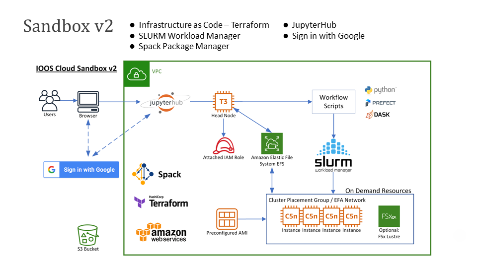

# IOOS Cloud Sandbox

The IOOS Cloud Sandbox is a collaborative platform for running regional coastal models in the cloud.

It provides repeatable configurations, model code and required libraries, input data, and analysis of model outputs. The Sandbox provisions Cloud HPC to aid in the development of services and models, and also supports running and validating models. The Sandbox is intended for use across industries and is inclusive to anyone who wants to develop, enhance, and run coastal models.

### Use cases
- Inter-organization collaboration
- University graduate courses
- Hindcasts/Reanalysis
- Research to Operations (R2O)
- On-demand HPC capacity
- Quasi-operational HPC fail-over (natural disasters, data-center problems)
- AI/ML training

### Deployment options

- **Self deployed/hosted**: Deploy using your own AWS cloud account
- **NOS hosted**: NOAA AWS Government Cloud – Lynker contract
- **Tetra Tech hosted**: Isolated secure Virtual Private Cloud (VPC)

### The Cloud Sandbox has been used to run:

- Operational versions of the [NOSOFS ROMS and FVCOM Models](https://github.com/ioos/nosofs-NCO)
- [LiveOcean model](https://comt.ioos.us/projects/liveocean) from the University of Washington
- WRF/ROMS ESMF Coupled (Hurricane Irene test case)
- WRF/ROMS/SWAN
- ADCIRC (Hurricane Florence test case)
- [CORA ADCIRC](https://registry.opendata.aws/noaa-nos-cora/) model
- [SCHISM](https://ccrm.vims.edu/schismweb/)
- [National Water Model](https://water.noaa.gov/about/nwm)

## I want to...

- Run a model in an existing cloud sandbox
    - [NOS OFS Models](NOSOFS-MODELS.md)
    - [LiveOcean Model](LIVEOCEAN-MODEL.md)

- [Deploy a new cloud sandbox](DEPLOYMENT.md)

## Software Stack

The Cloud Sandbox uses [CloudFlow](CLOUDFLOW.md) to orchestrate the execution of the model. CloudFlow is a customized workflow for running models built on [Prefect Workflows](https://docs-v1.prefect.io/api/0.15.13/).

## Software Architecture 

The Cloud Sandbox uses [Terraform](https://www.terraform.io/) to deploy resources to the cloud. The sandbox currently only supports the Amazon Web Services (AWS) cloud platform.

<!-- TODO update graph
    
-->

- **Head Node**: The head node is the machine that runs the CloudFlow scheduler. Users can SSH into this machine to run CloudFlow tasks.
- **Preconfigured AMI**: This Amazon Machine Image (AMI) contains all of the necessary code to run the model. This image will run on the worker nodes.
- **Worker Nodes**: The worker nodes are provisioned by Terraform and run CloudFlow tasks. This runs the preconfigured AMI.
