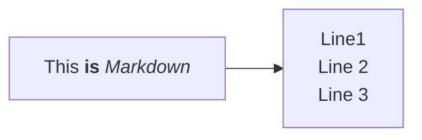

## Background

The [ioos-documentation-jekll-skeleton](https://github.com/ioos/ioos-documentation-jekyll-skeleton) repository is a template, or 'skeleton' starting point to create a new GitHub-based documentation site that uses the IOOS [documentation-theme-jekyll](https://github.com/ioos/documentation-theme-jekyll).

The instructions below will allow you to create a new GitHub Pages site that follows the look and feel/functionality of the Jekyll documentation theme used by the [https://ioos.github.io](https://ioos.github.io) site.  You can then add/edit the template markdown documents with your own content.


## Getting Started

### Step 1: Use the ioos-documentation-jekyll-skeleton template to create your own forked repository

This is done on the GitHub website.  These steps assume you already have a GitHub account in place.

1. Browse to the [ioos-documentation-jekyll-skeleton](https://github.com/ioos/ioos-documentation-jekyll-skeleton) repository, and select the 'Use this template' button and select 'Create your own repository': {:style="display:block; border: 1px solid"}

1. Name the repository, select the owner (your own account or a GitHub organization you have write permissions to) give it a description if desired, and select other options as appropriate.  At the end of this step, you should have a new repository available at the following URL: https://github.com/owner/my-new-documentation-repo. {:style="width: 600px; display:block; border: 1px solid"}

1. From your new repoistory page, download or 'clone' the repository to edit it locally using Jekyll/Ruby.  The local editing process assumes you have a git client installed in order to push your edited files back to GitHub, and that you're able to install the dependencies to run Jekyll (Ruby programming language).  For those who do not have git, or cannot run Ruby, editing can be accomplished on the GitHub website one file at a time (see [Step 2: Edit your documentation site content](#step-2-edit-your-documentation-site-content) below for details).  {:style="width: 350px; display:block; border: 1px solid"}


### Step 2: Setting up your site for editing

Editing content in your new fork of the documentation skeleton repository can be done in one of two ways:
1. Locally using a text editor, and optionally running in local development mode via a Ruby/Jekyll installation
1. Online using the GitHub website

Editing locally with Ruby/Jekyll is easier for making major changes to the site, including more complex changes to theme content such as configuring the sidebar navigation, working with images in the `/_docs/images/` folder, etc.  It requires a basic text editor for editing theme content, a local installation of Ruby/Jekyll to preview your changes, and git client to push your changes back to GitHub.  See the [Editing locally with Ruby/Jekyll](#editing-locally-with-rubyjekyll) section for details.

Editing in GitHub is easier for more minor content modifications such as editing text in individual markdowns file, one at a time.  See the [Editing online in GitHub](#editing-online-in-github) section for details.


#### Editing locally with Ruby/Jekyll
This approach allows instantaneous rendering of the site exactly as it will appear in GitHub Pages so you can more rapidly iterate changes.  Once you are happy with your changes, you can then commit them to your git branch locally, and push them with git to GitHub to update the online GitHub Pages site (or follow the GitHub PR workflow if you prefer).  Using git is outside the scope of this HOWTO, but lots of documentation and tutorial are available onine to learn git.

**Setting up the Ruby/Jekyll environment:** 

Instructions are avaialable in the Jekyll Documentation Theme [Getting Started documentation](https://idratherbewriting.com/documentation-theme-jekyll/index.html) - this is the upstream Jekyll theme that the IOOS documentation theme is based on.  

Follow these steps first to get your Jekyll environment running, in particular, use the [Option 2: Build theme with github-pages gem](https://idratherbewriting.com/documentation-theme-jekyll/index.html#option2) approach to run the site, or read on to the section below.

**Running the site in Jekyll:**

Some modifications to the theme have been made for IOOS' purposes. Therefore, instead of using the exact `bundle` commands included in the Jekyll Documentation Theme instructions to run the site, use the following instead:

Run Jekyll via Bundler in incremental build, verbose logging mode (using the `_config_dev.yml` for local development settings):
```
bundle exec jekyll serve --config _config.yml,_config_dev.yml --watch --verbose --incremental
```

If changing headers and menus, stop the running server by entering `ctrl-c` in the terminal. Then, clean up the locally-built site (in the `_site` directory) and re-run:
```
bundle exec jekyll clean
bundle exec jekyll serve --config _config.yml,_config_dev.yml --watch --verbose --incremental
```


By default, the `bundle exec jekyll serve` command will serve the site on your machine at: 

[http://localhost:4000/ioos-documentation-jekyll-skeleton/](http://localhost:4000/ioos-documentation-jekyll-skeleton/)

Once you have the site running, you will want to modify the settings found in the `_config.yml`, `_config_dev.yml` files to change the site URL from 'ioos-documentation-jekyll-skeleton' to a URL of your choosing, and make other modifications as appropriate.  

See the [Editing and configuring your documtenation site](#editing-and-configuring-your-documentation-site) section for futher explanation of these and other important theme files to familiarize yourself with and modify as appropriate.


#### Editing online in GitHub
When you are setting up a new documentation site initially, you will likely want to use the Ruby/Jekyll approach described above to get your site configured.  Once this has been accomplished and your site is running in GitHub Pages, you can make minor edits to your site  directly on GitHub with your browser in three simple steps:
1. Go to the page you want to edit, and click on the "Edit me" button just below the page Title and Summary;
1. Open it for editing by clicking on the "pencil" icon at the right side above the file content;
1. Make all changes, preview them to make sure that everything is OK.
1. As best practice, it's typically good to select "Create a new branch for this commit and start a pull request". No need to worry about what you call the branch. Then, click "Propose changes". This gives folks who are monitoring the repo an opportunity to review the changes and provide comments. Typically it's catching typos/markup issues.
   1. Another option is to "Commit directly to the gh-pages branch". This simply merges your changes directly into the file without review.


A visual walkthrough of this process is also available in the [Editing Markdown Files for GitHub Pages](https://docs.google.com/presentation/d/1OBZumh-vK3tynt90_2GH_Xdp1LVuI-wao70FVzGp3Vg/edit#slide=id.p) Google Slides presentation.


## Editing and configuring your documentation site

The table below lists important theme configuration files (which will require editing and customization for newly-created sites), and lists important directories in which to place content for your site.

|**Name**|**Description**|
|--------|------------|
|`_config.yml` | Main Jekyll configuration files.  Modify settings in these to change anything related to the theme.  The important settings to update are primarily located at the top of the file, and include settings like: 'title', 'name', 'description', 'baseurl', among others.  More documentation can be found in the 'Documentation Theme for Jekyll' original documentation (see below).|
|`_config_dev.yml` | Settings for running the site locally via Ruby/Jekyll in development mode.  You should only need to modify the `baseurl` setting for your documentation site to align with that of `_config.yml`.|
|`/_data/sidebars/sidebar_ioos.yml`| Configuration file for a side accordion navigation menu.  Further description of the configuration details and how they work is beyond the scope here, refer to the Jekyll and the 'Documentation Theme for Jekyll' original documentation for more info.|
|`/_docs/`| Directory to place any GitHub-standard markdown (.md) content to publish.|
|`/_docs/index.md`| The markdown file that contains the content for the 'homepage' (index.html) for the site - this should be updated/replaced accordingly.|
|`/_docs/images/`| A folder to add any image content to reference in your documentation pages.|


### Configuring the side navigation bar

The sidebar navigation adapts to the documentation. Although the theme allows to use several sidebars (see `_config.yml` file), a single sidebar 'ioos_sidebar' is used by default for IOOS' implementation. The sidebar name must be specified either in the `_config.yml` in the 'defaults' section (as it is in this skeleton repo), or it may be configured on a page-by-page basis in the page's frontmatter. Here's an example of the page frontmatter showing the sidebar property:

```
---
title: Alerts
tags: [formatting]
keywords: notes, tips, cautions, warnings, admonitions
last_updated: July 3, 2016
summary: "You can insert notes, tips, warnings, and important alerts in your content. These notes are stored as shortcodes made available through the linksrefs.html include."
sidebar: ioos_sidebar
permalink: mydoc_alerts
---
```

The `sidebar: ioos_sidebar` refers to the `_data/sidebars/ioos_sidebar.yml` file. The sidebar data file uses a specific YAML syntax that you must follow. Follow the sample pattern shown in the theme, specically looking at `ioos_sidebar.yml` as an example.

For more details on the sidebar syntax, see [Sidebar navigation](http://idratherbewriting.com/documentation-theme-jekyll/mydoc_sidebar_navigation.html).


### Editing markdown documents

This theme uses a Kramdown variety of the Markdown - a lightweight markup language with plain text formatting syntax. The Kramdown is a superset of Markdown that supports standard Markdown and various extensions. The GitHub Pages naturally support rendering documents in Kramdown through the GitHub Jekyll implementation. The detailed description of the Kramdown syntax can be found by following the links in the Reference section below.

Every document must start with the so-called frontmatter properties:

```
---
title: "Some title"
tags: [sample1, sample2]
keywords: keyword1, keyword2, keyword3
last_updated: Month day, year
summary: "optional summary here"
sidebar: sidebarname
topnav: topnavname
toc: false
#search: exclude
#permalink: filename.html
---
```

For titles, surrounding the title in quotes is optional, but if you have a colon in the title, you must surround the title with quotation marks. If you have a quotation mark inside the title, escape it first with a backlash `\`.

Values for `keywords` get populated into the metadata of the page for SEO.

Values for `tags` must be defined in your `_data/tags.yml` list. You also need a corresponding tag file inside the tags folder that follows the same pattern as the other tag files shown in the tags folder. (Jekyll won't auto-create these tag files.)

In the current version of the theme, the `permalink` property value interferes with other collection settings; therefore it should be commented in the frontmatter. However, it should not be removed as it may be needed in future versions.

Value for `search` controls inclusion of the document content into theme search mechanism. If you want to be able to perform basic search through your site documents, make sure that this property is commented in the frontmatter.

Follow the sample pattern shown in the theme, specifically looking at Markdown sample documents in the `_docs` folder as an example.

#### Adding Mermaid diagrams to a page

Our pages now have the capability to render [Mermaid diagrams](https://mermaid.js.org/). To include a Mermaid diagram on a documentation page:

1. add `mermaid: true` to the front matter of the page you want the diagram on
2. insert the diagram following the [Mermaid syntax](https://mermaid.js.org/syntax/flowchart.html) as follows:

<div class="language-markdown highlighter-rouge"><div class="highlight"><pre class="highlight"><code>
```mermaid
%%{init: {"flowchart": {"htmlLabels": false}} }%%
flowchart LR
    markdown["`This **is** _Markdown_`"]
    newLines["`Line1
    Line 2
    Line 3`"]
    markdown --&gt; newLines
```
</code></pre></div></div>

Here is the above code rendered as a flowchart:




**Note:** A [hexagon node](https://mermaid.js.org/syntax/flowchart.html#a-hexagon-node) ({{}}) will break the mermaid diagram syntax when jekyll renders it into an html webpage. For more details on this gotcha, see [this discussion](https://github.com/ioos/mbon-docs/issues/58#issuecomment-2343676525).

For more information about Mermaid diagrams, including a live editor, checkout the [documentation page](https://mermaid.js.org/intro/).

### A note on submodules  

This theme uses two GitHub 'submodules'.  Submodules are essentially links to other GitHub repositories that allow certain components of the site to be synchronized more easily across all of IOOS' GitHub Documentation sites [https://ioos.github.io](https://ioos.github.io).

For example, the menu bar at the top of the page is configured with a single YAML file in a submodule, and the tyeme code itself, including site functionality and look and feel is kept within a submodule.

The git submodules for this skeleton repository are sourced from the [ioos/documentation-theme-jekyll](https://github.com/ioos/documentation-theme-jekyll) repository and located in the following submodule paths (as configured in the `.gitmodules` file in the repository root):

|**Submodule Path**|**Branch Name**|**Description**|
|--------|------------|------------|
|`/_data/navbars/`| navbars | the YAML configuration file for the IOOS top navigation bar (`topnav_ioos.yml`) |
|`/theme/`| main | the Jekyll theme files containing the look and feel and functionality of the site |

#### Updating submodules in a local development clone

If you're doing local development with git and Jekyll and your local working copy is out of date (some number of commits behind the GitHub-hosted source repository), the workflow to follow to update your local working copy is slightly more complicated due to the presence of the submodules.  

First, follow a typical git process to pull in the remote changes from GitHub.  Assuming `origin` is the git remote repo alias and `gh-pages` is the working branch, run either of the following commands to update your working copy:
```
git pull
```
or
```
git fetch origin
git merge origin/gh-pages
```

At this point, running a `git status` command may indicate that your working copy contains commits on the submodules that differ from the remote repo you're working with, This looks something like the following:
```
git status
On branch gh-pages
Your branch is up-to-date with 'origin/gh-pages'.
Changes not staged for commit:
  (use "git add <file>..." to update what will be committed)
  (use "git checkout -- <file>..." to discard changes in working directory)

        modified:   _data/navbars (new commits)
        modified:   theme (new commits)
```

This means you must also update the submodules to match the commit recorded in the latest commit of the superproject (i.e. the documentation repo itself).  

Pull in any upstream changes to submodules by running either of the following (`--init` may be needed in some circumstances):  
```
git submodule update --init
git submodule update
```

You can confirm the submodules are configured correctly to track the upstream repository branches (and not tagged to a specific commit) by running:
```
git submodule status
```

Which should output something like the following (showing the hash of the commit currently checked out, the submodule name, and the remote branch tracked):
```
edb2048843b71191909d53428b969f53bfbe4757 _data/navbars (remotes/origin/navbars)
d958aec9981aacace8c08dc6b2da147afdab9af6 theme (remotes/origin/main)
```

Additionally, running `git status` again should resolve the modified status of both submodule paths (meaning your working copy is now fully in-sync with the latest remote commit on GitHub) and you can now commit new changes without affecting the submodule commit history:
```
git status
On branch gh-pages
Your branch is up-to-date with 'origin/gh-pages'.
nothing to commit, working directory clean
```
Working with submodules can be tricky, however the steps above should work in most cases.  For full documentation on the `git submodule` command, see: [https://git-scm.com/docs/git-submodule](https://git-scm.com/docs/git-submodule).  

There shouldn't be any need to modify code in either of the submodules manually, they are meant to be identical across all of the individual IOOS GitHub Documentation sites, they need only be properly updated in local working copies before submitting any changes back to GitHub.  Both submodules are also automatically syncrhonized in GitHub with changes in the source [ioos/documentation-theme-jekyll](https://github.com/ioos/documentation-theme-jekyll) repository via GitHub Actions as configured in the `.github/workflows/sync_theme.yml` file.  For the ioos/ioos-documentation-jekyll-skeleton repository, that file can be found [here](https://github.com/ioos/ioos-documentation-jekyll-skeleton/blob/gh-pages/.github/workflows/sync_theme.yml).


## References  

 - [Original Documentation for the Documentation Theme for Jekyll](http://idratherbewriting.com/documentation-theme-jekyll/index.html)
   - [Ruby & Jekyll Installation and Setup Section](http://idratherbewriting.com/documentation-theme-jekyll/mydoc_about_ruby_gems_etc.html)
 - [A Comprehensive Guide for Jekyll](https://jekyllrb.com/docs/)
 - [Ruby documentation & downloads](https://www.ruby-lang.org/en/)
    - [Ruby Installer for Windows](http://rubyinstaller.org/downloads/)
    - [A Guide on Ruby Installation and Setup for Windows 10](https://www.digitalocean.com/community/tutorials/how-to-install-ruby-and-set-up-a-local-programming-environment-on-windows-10)
 - [General information on the way GitHub uses Jekyll in 'GitHub Pages' sites](https://help.github.com/articles/about-github-pages-and-jekyll/)
    - [In particular, how to use a specially-named branch 'gh-pages' to push documentation for a 'Project' page (which most repos will fall under)](https://help.github.com/articles/user-organization-and-project-pages/)
 - GitHub Kramdown:
    - [Kramdown Syntax](https://kramdown.gettalong.org/syntax.html)
    - [Kramdown Quick Reference](https://kramdown.gettalong.org/quickref.html)

## FAQ

### The theme isn't rendering properly when deployed to the web.
If it looks something like:

   * Check that `_config.yml` and `_config_dev.yml` are pointing to the right repository (see this PR as an example https://github.com/ioos/glider-dac/pull/216/files).
